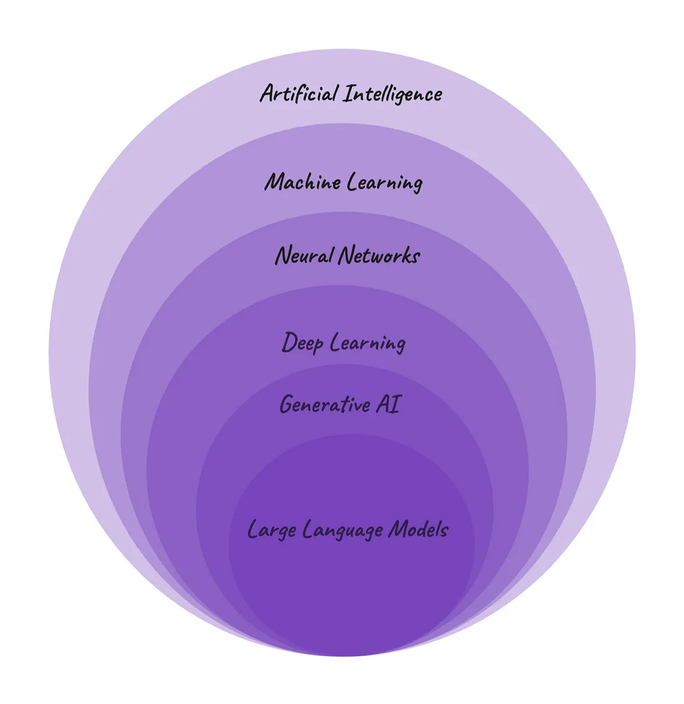

# What are LLM-s?
 
LLM-s are a bit like ogres. Why? Because ogres are like onions and onions have layers. So do LLM-s :) 

In a broad sense large language models are an example of **artificial intelligence (AI)** because they aim to simulate human intelligence and skills in a computer system. LLM-s are able to perform language tasks like conversational dialogue, translations or content creation, just like humans do.

Moving on to the next level, LLM-s are an example of a subset of AI called **machine learning (ML)** understood as learning from data to make predictions. Large language models predict what word comes next in a sentence based on the probability.

LLM-s also use artificial **neural networks** that mimic the way human brain cells (neurons) work. Just like neurons form a highly interconnected network and send electrical signals between each other to process information, so do artificial neural networks cooperate to solve different tasks.

Neural networks make up the backbone of the **deep learning** architecture. It is called "deep" because it consists of several (not just one) hidden layers that learn from the vast amounts of data.

At its core, LLM-s are **generative AI**. Generative AI are deep-learning models that can generate high-quality content, such as text, images, audio, videos etc. based on the data they were trained on.
 
 

# How do LLM-s work?
## Transformer architecture
## Attention mechanism
# LLM training
## LLM training stages
## Evaluating LLM-s after training
# Types of LLM-s
# Advantages and use cases of LLM-s
LLM-s have many advantages like:

- **efficiency** - thanks to LLM-s tasks can be automated, thus reducing the manual human effort.
- **scalability** - LLM-s can be scaled to handle large amounts of data.
- **flexibility** - LLMs-s can be adjusted to specific use cases and needs.  
- **improved user experience** - LLM-s can increase user's satisfaction while interacting with chatbots, virtual assistants etc. providing more context-aware responses.

Large language models may be used for many purposes, by individuals as well as enterprises. The most common applications are:

- **content generation** - LLM-s can create human-like text like product descriptions, blog posts, news articles, poems, scripts and many more. They can also rephrase text while preserving its original meaning.
- **content summarization** - LLM-s can summarize lengthy texts and extract the most important pieces of information.
- **content research and information retrieval** - LLM can filter vast amounts of data to extract relevant information.
- **coding** - LLM-s can produce code snippets or provide explanations for programming concepts.
- **language translation and localization** - LLM-s can provide more accurate and context-aware translations between languages. 
- **sentiment analysis** - LLM-s can recognize whether the data (for example customers' reviews) are positive, negative or neutral.
- **conversational AI and chatbots** - LLM-s can answer questions and hold natural, human-like text conversations with users which can be used for customer service, technical support or personal assistance. 
- **classification and categorization** - LLM-s excel at classifying and categorizing content based on some predefined criteria. It can be used for categorizing customer support tickets, emails or documentation.
- **personal recommendations** - LLM-based recommendation systems offer users personalized suggestions based on their previous preferences and behavior.

# Challenges and limitations of LLM-s

While LLM-s have many advantages and may be used for different positive purposes, they also come with their own challenges and limitations like:

- **bias** - depending on what is in the data the LLM-s were trained on, the possible answers may be biased or even discriminatory.
- **misinformation and hallucinations** - LLM-s may generate false or misleading information. It can have a serious impact especially in fields like healthcare, engineering or law since they require high levels of accuracy and can seriously influence people's lives.
- **information leaks** - since LLM-s are trained on vast amounts of data, they may contain also private data and sensitive information.
- **stale data** - if LLM-s don't have access to real-time facts and events, the generated answers are only as up-to-date as the training data they were trained on.
- **plagiarism** -  LLM-s are prone to pick content without knowing where it was initially created, thus they may violate copyright and intellectual property.
- **lack of transparency and explainability** - LLM-s often function like a black box with hidden decision making process where it is not traceable how they actually arrived at certain outputs.
- **glitch tokens** - LLM-s may contain glitch tokens which are specific words or strings that cause them to behave in unexpected and often nonsensical ways, for example repeat certain phrases not related to the question. 
- **impact on the environment** - developing LLM-s requires considerable computational resources, which causes energy consumption and a large carbon footprint.
- **skill degradation** - if not used properly, LLM-s may contribute to skill reduction in students who rely overly on LLMs for example for writing essays, which in turn decreases their learning and writing skills.
- **job displacement** - innovations like LLM-s and, more generally, AI will drastically change or replace some of the job roles.
- **lack of accountability** - as LLM-s become more advanced, it will be more challenging to attribute who should be held accountable for the potential harmful outputs they produce.
- **ethical considerations** - LLM-s may be used to manipulate or deceive people, for example through creating deepfakes, phishing attacks or social engineering schemes.
 
# Glossary
<dl>
  <dt><strong>Artificial Intelligence (AI)</strong></dt>
  <dd>A branch of computer science which aims to simulate human intelligence and problem-solving capabilities in machines.</dd>
  <dt><strong>Machine Learning (ML)</strong></dt>
  <dd>A subfield of artificial intelligence that uses algorithms that learn from patterns in data to make predictions without being explicitly programmed. There are 4 basic types of machine learning:

  - supervised learning - uses labeled datasets;
   
  - unsupervised learning - uses unlabeled datasets;
  
  - semi-supervised learning - uses both labeled and unlabeled datasets;
  
  - reinforcement learning - mimics the trial-and-error learning process in humans.</dd>
  <dt><strong>Neural Network (NN)</strong></dt>
  <dd>A group of interconnected artificial neurons that teaches computers to process data in a way that is inspired by the neurons in the human brain.</dd>
  <dt><strong>Deep Learning (DL)</strong></dt>
  <dd>A branch of machine learning that uses multiple layers of neural networks to learn from data.</dd>
  <dt><strong>Generative AI (GenAi)</strong><dt>
  <dd>A subset of AI capable of creating new content (text, images, audio, videos etc.) that resembles real-world data.</dd>
</dl>

# Bibliography
[Artificial Intelligence, Machine Learning , Deep Learning, GenAI and more](https://medium.com/womenintechnology/ai-c3412c5aa0ac)

[AI vs. Machine Learning vs. Deep Learning vs. Neural Networks: What’s the difference?](https://www.ibm.com/blog/ai-vs-machine-learning-vs-deep-learning-vs-neural-networks/)

[What is a large language model (LLM)?](https://www.elastic.co/what-is/large-language-models)

[Large Language Model (LLM)](https://www.techopedia.com/definition/34948/large-language-model-llm)

[LLMs vs. Traditional Language Models: A Comparative Analysis](https://www.appypie.com/blog/llms-vs-traditional-language-models)

[Demystifying Large Language Models (LLMs) for Beginners](https://anuja-herath.medium.com/demystifying-large-language-models-llms-for-beginners-ec80e5d7929d)

[Generative AI for Beginners: Part 1 — Introduction to AI](https://medium.com/@raja.gupta20/generative-ai-for-beginners-part-1-introduction-to-ai-eadb5a71f07d)
 
[LLM Training](https://www.run.ai/guides/machine-learning-engineering/llm-training)

[Transformers — Intuitively and Exhaustively Explained](https://towardsdatascience.com/transformers-intuitively-and-exhaustively-explained-58a5c5df8db)

[How do Transformers work?](https://huggingface.co/learn/nlp-course/chapter1/4)

[Encoder Decoder Architecture](https://www.larksuite.com/en_us/topics/ai-glossary/encoder-decoder-architecture)

[Evaluating Large Language Models (LLMs): A Standard Set of Metrics for Accurate Assessment](https://www.linkedin.com/pulse/evaluating-large-language-models-llms-standard-set-metrics-biswas-ecjlc)